# PRAKTIKUM TEKNOLOGI CLOUD - PERTEMUAN 1

## NAMA : FARIDHOTUL KHASANAH / 175410026
## PRAKTIK INSTALASI GIT!

1. Mendaftarkan akun melalui github.com
2. Membuat repository bernama tcc
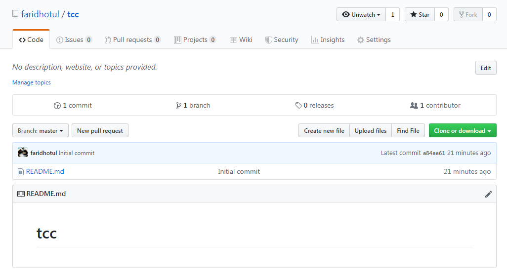

**Instalasi Git bash**
1. Setelah di download, double klik file instalasi git bash. 

Kemudian akan muncul kotak dialog autentifikasi maka pilih _**YES**_

2. Akan muncul Kotak dialog untuk menyetujui lisensi yang ada pada git, pilih _**Next**_
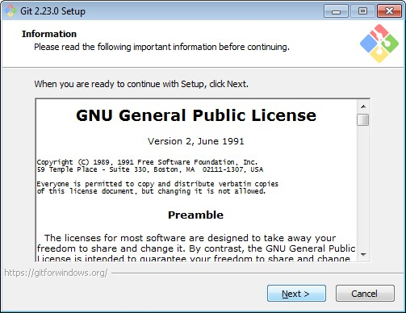

3. Pilih lokasi yang akan digunakan untuk menginstall git bash. Kemudian _**Next**_
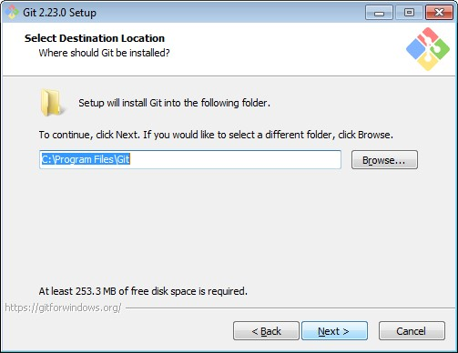

4. Pilih komponen yang akan diinstall di local. Biarkan default. Kemudian _**Next**_
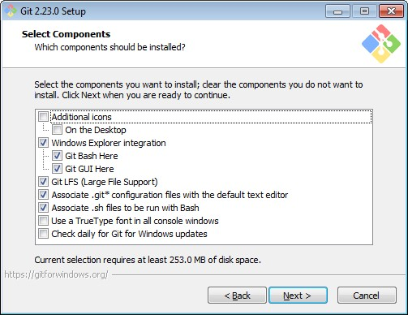

5. Anda akan diminta untuk memilih folder mana yang akan diinstall i git. Pilih default saja. Kemudian _**Next**_
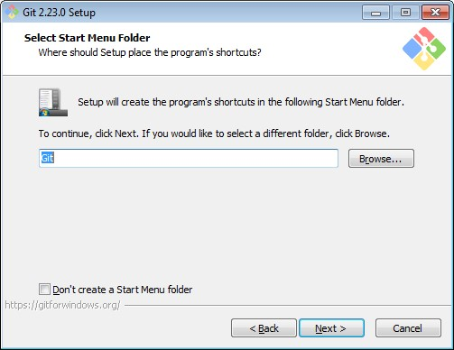

6. Pilihlah editor default yang akan digunakan. Pilih saja notpad++. Kemudian _**Next**_
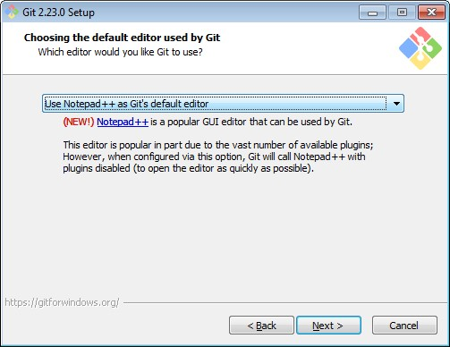

7. Pilih default pada bagian PATH. Kemudian _**Next**_

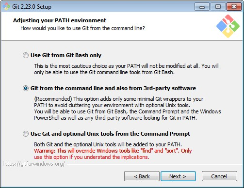

8. Pilih default pada bagian ini. Kemudian _**Next**_

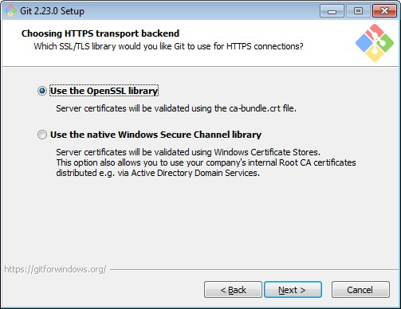

9. Pilih default pada bagian ini. Kemudian _**Next**_

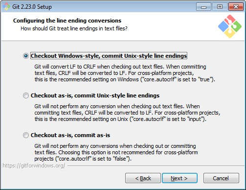

10. Pilih default pada bagian konfigurasi terminal emulator. Kemudian _**Next**_

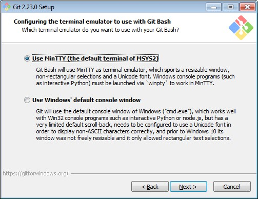

11. Pilih default pada bagian konfigurasi fitur yang akan diinstall. Kemudian _**Next**_

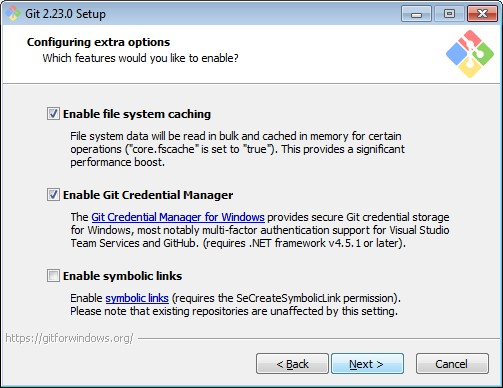

12. Pada bagian terakhir, kita langsung biarkan default saja. Kemudian _**Install**_

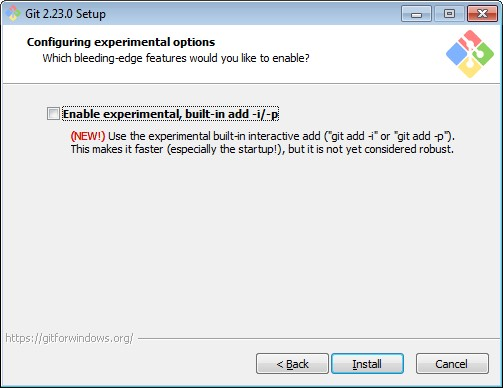

13. Proses instalasi sedang berjalan, tunggu hingga proses selesai.

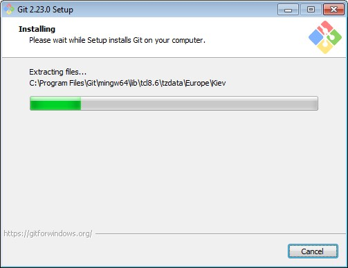

14. Proses instalasi sudah selesai. Pilih _**Finish**_

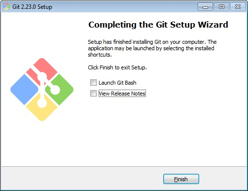

15. Untuk mencari git bash yang sudah kita install, kita cukup masuk ke _**Star**_ >> cari _**git**_ >> pilih yang _**git bash**_

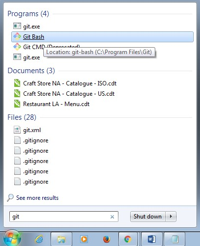

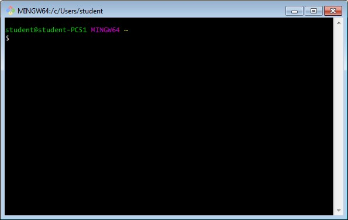

Tampilan diatas adalah tampilan yang menggambarkan penggunaan git dengan CLI/ command line. 

16 Untuk tampilan yang GUI, kita bisa klik kanan pada folder kerja kita, kemudian pilih _**Git GUI Here**_

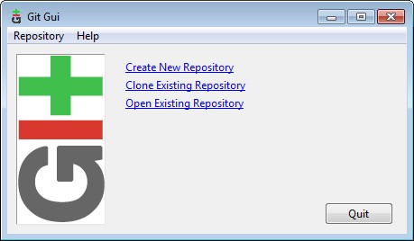