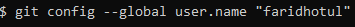

# PRAKTIKUM TEKNOLOGI CLOUD - PERTEMUAN 2

## NAMA : FARIDHOTUL KHASANAH / 175410026
## PRAKTIK KONFIGURASI GIT

1. Buka gitbash pada folder yang sudah di clone.
2. Ketikkan code berikut diisikan dengan username yang sama dengan saat mendaftar ke git.
   
   `$ git config --global user.name "faridhotul"`

    

3. Ketikkan code berikut, isikan email yang digunakan saat mendaftar git. 
   
   `$ git config --global user.email faridhotul.khasanah@gmail.com`

   

4. Untuk melihat konfigurasi, ketikkan :
   `$ git config --list`
   
   