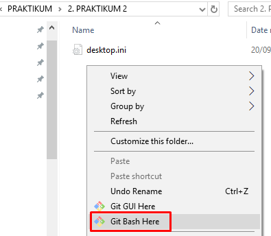
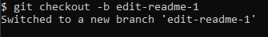
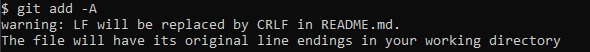
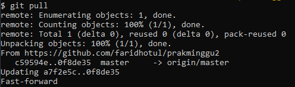

# PRAKTIKUM TEKNOLOGI CLOUD - PERTEMUAN 2

## NAMA : FARIDHOTUL KHASANAH / 175410026
## PRAKTIK KONFIGURASI GIT

1. Buka gitbash pada folder yang sudah di clone.
2. Ketikkan code berikut diisikan dengan username yang sama dengan saat mendaftar ke git.
   
   `$ git config --global user.name "faridhotul"`

    

3. Ketikkan code berikut, isikan email yang digunakan saat mendaftar git. 
   
   `$ git config --global user.email faridhotul.khasanah@gmail.com`

   

4. Untuk melihat konfigurasi, ketikkan :
   `$ git config --list`
   
   
   
   
## PRAKTIK MENGELOLA REPO SENDIRI DI ACCOUNT SENDIRI
### 1. Membuat Repo

Langkah-langkahnya :

1.1 Klik tanda + pada bagian atas setelah login, pilih New repository

1.2 Isikan nama, keterangan, serta lisensi. Jika dikehendaki, bisa membuat repo Private

1.3 Kemudian "Create Repository"

Bisa mengakses url disini : https://github.com/faridhotul/prakminggu2

### 2. Clone Repository

2.1 Clone repository dengan cara copy terlebih dahulu url untuk melakukan clone. Klik pada tombol _**Clone or Download > copy url**_

2.2 Setelah dicopy kan, silahkan masuk kedalam folder lokal untuk meng-clone project. Kemudian lakukan _**Klik Kanan > Git bash here**_

2.3 Kemudian ketikkan perintah 

`$ git clone https://github.com/faridhotul/prakminggu2.git`

2.4 Maka folder kosong yang sudah kita berikan clone proyek akan berubah menjadi ada isinya, yaitu project dari git. 

### 3. Mengelola Repo

3.1 Mengubah Isi - Push Tanpa Branching dan Merging

Membuat sebuah file dan dipush kedalam repository. 

1. Melakukan change directory. 

`$ cd prakminggu2`

2. Setelah masuk kedalam direktori tersebut, saya membuat file dengan nama README.md

`$ vim README.md`

Saya isikan "Halo my name is Faridhotul"

3. Melihat isi file. 

`$ cat README.md`

4. Melihat status direktori yang sekarang dijalankan.

`$ git status`

5. Menambahkan file kedalam direktori

`$ git add -A`

6. Commit file kedalam repository

`$ git commit -m "Add: README.md"`

7. Memasukkan file kedalam repository dengan istilah push kedalam origin master. 

`$ git push origin master`

Folder dalam local kita setelah membuat file README.md

Repository sebelum file dipush 

Repository setelah file dipush

3.2 Mengubah Isi dengan Branching and Merging

a. Buat branch untuk menampung perubahan-perubahan

`$ git checkout -b edit-readme-1`

Setelah membuat branch

Pada lokal kita akan terbentuk branch

b. Lakukan perubahan-perubahan

`$ vim README.md`

`$ cat README.md`

cek status branch

c. Add dan commit perubahan-perubahan tersebut ke branch

`$ git add -A`

`git commit -m "Add: README.md"`

d. Kembali ke repo master

`$ git checkout master`

e. Buat pull request di GitHub

`$ git push origin edit-readme-1`

Kirim pull request

Klik **Merge pull request"**

Klik **"confirm merge"**

Hasil setelah di pull request

f. Merge pull request di GitHub

`$ git merge edit-readme-1`

g. Merge branch untuk menampung perubahan-perubahan tersebut ke master.

`$ git branch -D edit-readme-1`

`$ git branch`

`$ git pull`

h. Selesai.

### 4. Sinkronisasi

`$ git pull`

### 5. Membatalkan Perubahan

a. Membuat branch untuk menampung perubahan-perubahan

`$ git checkout -b edit-readme-2`

b. Membuat file

`$ vim README.md`

`$ cat README.md`

c. Kembali ke master

`$ git checkout master`

d. Melihat file

`$ cat README.md`

e. Menghapus branch

`$ git branch -D edit-readme-2`

`$ git branch`

f. Melihat perubahan file walaupun brach sudah dihapus

`$ cat README.md`

g. Melakukan pembatalan perubahan

`$ git reset --hard`

h. Melihat file, perubahan tidak terjadi

`$ cat README.md`

### 6. Undo Commit Terakhir
