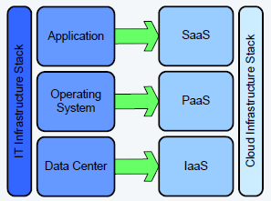

# PRAKTIKUM TEKNOLOGI CLOUD - PERTEMUAN 3

## NAMA : FARIDHOTUL KHASANAH / 175410026
## PRAKTIKUM - SAAS

## Definisi SaaS
SaaS (software as a service atau perangkat lunak berbentuk layanan) adalah suatu model penyampaian aplikasi perangkat lunak oleh suatu vendor perangkat lunak yang mengembangkan aplikasi web yang diinangi dan dioperasikan (baik secara mandiri maupun melalui pihak ketiga) untuk digunakan oleh pelanggannya melalui Internet.

## Contoh Aplikasi
- Google drive
- Facebook
- git

## Arsitektur SaaS
