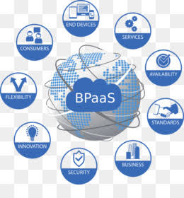

# PRAKTIKUM TEKNOLOGI CLOUD - PERTEMUAN 4

## NAMA : FARIDHOTUL KHASANAH / 175410026
## PRAKTIKUM - BPAAS

## Definisi BPAAS
BPAAS kependekan dari Bussiness Process as a Service. Yaitu setiap jenis proses bisnis horizontal atau vertikal yang disampaikan berdasarkan model layanan awan.

Perbedaan antara aplikasi kemasan tradisional dan BPaaS adalah bahwa BPaaS dirancang untuk berorientasi pada layanan. Jadi, BPaaS cenderung memiliki antarmuka yang terdefinisi dengan baik. Selain itu, BPaaS adalah layanan standar untuk digunakan oleh banyak organisasi yang berbeda. Karena layanan ini jauh lebih optimal untuk memberikan layanan secara konsisten, mereka dapat memanfaatkan otomasi, standarisasi, dan pengulangan dalam cara layanan digunakan dan dikirimkan.

## Karakteristik berikut menentukan BPAaS:

- BPaaS duduk di atas tiga layanan awan pendiri lainnya: SaaS, PaaS, dan IaaS.

- Layanan BPaaS dapat dikonfigurasi berdasarkan proses yang sedang dirancang.

- Layanan BPaaS harus memiliki API yang terdefinisi dengan baik sehingga mudah dihubungkan ke layanan terkait.

- BPaaS harus dapat mendukung banyak bahasa dan beberapa lingkungan penerapan karena bisnis tidak dapat memprediksi bagaimana proses bisnis akan dimanfaatkan di masa depan.

- Lingkungan BPaaS harus bisa menangani skala besar. Layanan harus bisa pergi dari pengelolaan beberapa proses untuk beberapa pelanggan untuk dapat mendukung ratusan bahkan ribuan pelanggan dan proses. Layanan ini mencapai tujuan tersebut dengan mengoptimalkan layanan awan yang mendasari untuk mendukung jenis elastisitas dan penskalaan ini.

## Contoh Aplikasi

Pembagian secara fungsi dibagi menjadi :

1. CRM

CRM (Customer Relationship Management) dalam bahasa Indonesia memiki pengertian dasar, yakni suatu Management Hubungan Pelanggan atau merupakan suatu strategi pemasaran yang saat ini sangat banyak dilakukan oleh perusahaan-perusaan yang menginginkan pelanggan atau konsumen mereka tetap membeli produk atau memakai jasa mereka, dalam artian umum yakni adalah suatu proses dari beberapa tahapan yang terdiri dari Indentifikasi, akuisisi, retensi dan pengembangan customer yang memberikan kontribusi yang besar kepada perusahaan dengan cara memfokuskan strateginya yaitu dengan cara menjaga hubungan dengan customer secara efektif dan efisien sehingga hubungan tersebut menjadi hubungan seumur hidup (“lifetime”) yang  menguntungkan.

Contoh CRM:

- Vtiger

- Salesforce

2. SCM 

SCM (Supply Chain Management) adalah konsep atau mekanisme untuk meningkatkan produktivitas total perusahaan dalam rantai suplai melalui optimalisasi waktu, lokasi dan aliran kuantitas bahan.

## Arsitektur 

