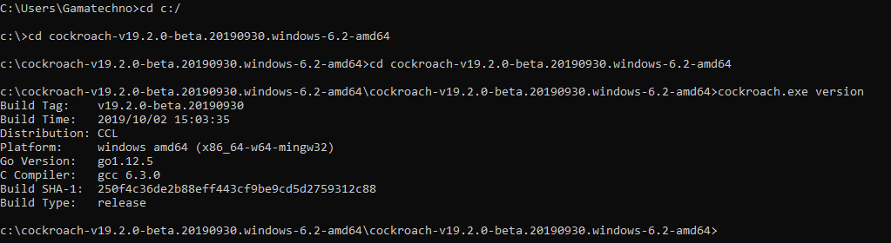

# PRAKTIKUM TEKNOLOGI CLOUD - PERTEMUAN 5

## NAMA : FARIDHOTUL KHASANAH / 175410026
## PRAKTIKUM - Install CockroachDB on Windows

1. First of all, before you install cockroachDB, you can choose 2 ways to doing the instalation. You can download from this site https://www.cockroachlabs.com/docs/dev/install-cockroachdb-windows.html or you can  use Docker.
I already try use docker but Im sorry, Im still not finish it. So, now I can try with executable.

2. Just follow the instruction on that site (point 1). Waiting download process. 

3. Kemudian extract file yang sudah di download. 

4. Buka cmd dengan cara tekan Windows+R ketik "cmd"

5. Change directory, masuk kedalam folder yang ada cockroachDB nya. 

`C:\Users\Gamatechno>cd c:/`

`c:\>cd cockroach-v19.2.0-beta.20190930.windows-6.2-amd64`

`c:\cockroach-v19.2.0-beta.20190930.windows-6.2-amd64>cd cockroach-v19.2.0-beta.20190930.windows-6.2-amd64`

`c:\cockroach-v19.2.0-beta.20190930.windows-6.2-amd64\cockroach-v19.2.0-beta.20190930.windows-6.2-amd64>cockroach.exe version`
`Build Tag:    v19.2.0-beta.20190930`
`Build Time:   2019/10/02 15:03:35`
`Distribution: CCL`
`Platform:     windows amd64 (x86_64-w64-mingw32)`
`Go Version:   go1.12.5`
`C Compiler:   gcc 6.3.0`
`Build SHA-1:  250f4c36de2b88eff443cf9be9cd5d2759312c88`
`Build Type:   release`

