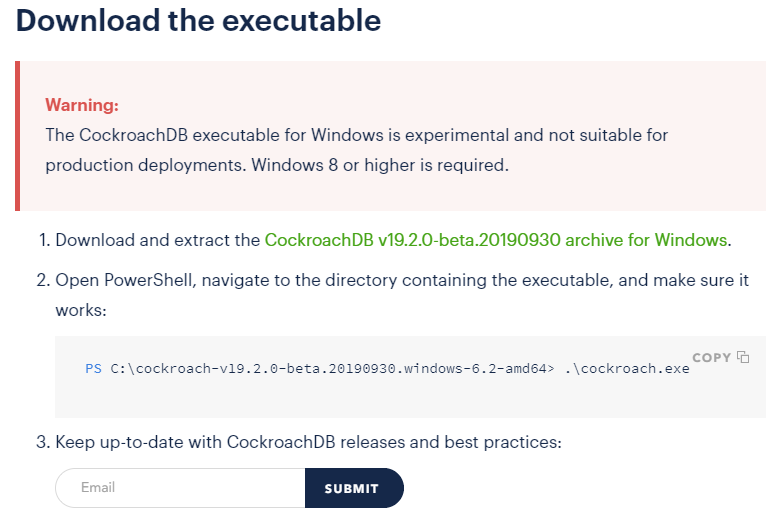

# PRAKTIKUM TEKNOLOGI CLOUD - PERTEMUAN 5

## NAMA : FARIDHOTUL KHASANAH / 175410026
## PRAKTIKUM - Install CockroachDB on Windows

1. First of all, before you install cockroachDB, you can choose 2 ways to do the instalation. You can download from this site [cockroachlabs](https://www.cockroachlabs.com/docs/dev/install-cockroachdb-windows.html) or you can  use Docker.
I will try to use executable instalation.



2. Just follow the instruction on that site (point 1). Waiting download process. 

3. Now, extract your file.

4. Open command prompt.

5. Change directory, make sure that your directoryis on cockroach executable. 

	```
	C:\Users\faridhotul>cd c:/
	c:\>cd cockroach-v19.2.0-beta.20190930.windows-6.2-amd64
	c:\cockroach-v19.2.0-beta.20190930.windows-6.2-amd64>cd cockroach-v19.2.0-beta.20190930.windows-6.2-amd64
	c:\cockroach-v19.2.0-beta.20190930.windows-6.2-amd64\cockroach-v19.2.0-beta.20190930.windows-6.2-amd64>cockroach.exe version
	Build Tag:    v19.2.0-beta.20190930
	Build Time:   2019/10/02 15:03:35
	Distribution: CCL
	Platform:     windows amd64 (x86_64-w64-mingw32) 
	Go Version:   go1.12.5
	C Compiler:   gcc 6.3.0
	Build SHA-1:  250f4c36de2b88eff443cf9be9cd5d2759312c88
	Build Type:   release
	```


6. I already try use exceutable instalation but Im sorry, Im still not finish it. So, now I can try with docker.

7. Langkah untuk melakukan instalasi cockroach menggunakan docker adalah sebagai berikut. 

8. Download docker terlebih dahulu di [docker](https://docs.docker.com/docker-for-windows/install/)

9. Kemudian, install dan masuk kedalam docker untuk windows. Kemudian, cek versi dari docker.

	```
	C:\Users\faridhotul>docker --version
	Docker version 19.03.2, build 6a30dfc
	```

10. Lanjut instalasi cockroach menggunakan docker

	```
	C:\Users\faridhotul>docker pull cockroachdb/cockroach
	Using default tag: latest
	latest: Pulling from cockroachdb/cockroach
	27833a3ba0a5: Pull complete
	7eeeadc1cbce: Pull complete
	58d28f3214d5: Pull complete
	7c994667c40c: Pull complete
	Digest: sha256:44249e8133bd5c02165703854a86d84089fa741a018071cfe41b5ce4cda7ac39
	Status: Downloaded newer image for cockroachdb/cockroach:latest
	docker.io/cockroachdb/cockroach:latest
	```

11.Kemudian, silahkan buat Bridge Network pada docker

	```C:\Users\faridhotul>docker network create -d bridge roachnet
	1f3ba672fe2ab44473730ce81de430782aadf9448fbca225a76991a19bb1e516
	```

12. Lalu silahkan jalankan service cockroachdb

	```
	C:\Users\faridhotul>docker run -d --name=roach1 --hostname=roach1 --net=roachnet -p 26257:26257 -p 8080:8080 cockroachdb/cockroach start --insecure
	ab92733cc6459193137544d4a299bcbe4be8de0a98f9eace848fa8adad83a396
	```

13. Jangan lupa untuk cek container, pastikan sudah UP. 

	```
	C:\Users\faridhotul>docker ps -a
	CONTAINER ID        IMAGE                   COMMAND                  CREATED             STATUS                      PORTS                                              NAMES
	ab92733cc645        cockroachdb/cockroach   "/cockroach/cockroac…"   5 minutes ago       Up 5 minutes                0.0.0.0:8080->8080/tcp, 0.0.0.0:26257->26257/tcp   roach1
	02f6c477dedb        hello-world             "/hello"                 56 minutes ago      Exited (0) 56 minutes ago                                                      ecstatic_neumann
	```

14. Test Cluster

	```
	C:\Users\faridhotul>docker exec -it roach1 ./cockroach sql --insecure
	# Welcome to the cockroach SQL interface.
	# All statements must be terminated by a semicolon.
	# To exit: CTRL + D.
	#
	# Server version: CockroachDB CCL v19.1.5 (x86_64-unknown-linux-gnu, built 2019/09/23 14:12:16, go1.11.6) (same version as client)
	# Cluster ID: 637eb681-1428-4a71-b30e-3a84a9d0ebd4
	#
	# Enter \? for a brief introduction.
	#
	root@:26257/defaultdb>
	```

15. Kemudian, kita buat database baru dengan nama tcc.

	```
	root@:26257/defaultdb>  create database tcc;
	CREATE DATABASE

	Time: 212.095ms
	```


16. Lihat database yang sudah dibuat dan database yang sudah ada didalam cockroach

	```
	root@:26257/defaultdb> show databases;
	  database_name
	+---------------+
	  defaultdb
	  postgres
	  system
	  tcc
	(4 rows)

	Time: 4.236ms
	```

17. Lalu gunakan database yang sudah dibuat .

	```
	root@:26257/defaultdb> use tcc;
	SET

	Time: 1.0155ms
	```

18. Membuat tabel kedalam database tcc. 

	```
	root@:26257/tcc> CREATE TABLE tcc.mahasiswa (id INT PRIMARY KEY, nim INT, nama STRING);
	CREATE TABLE

	Time: 193.1074ms
	```

19. Memasukkan data kedalam tabel yang sudah dibuat. 

	```
	pq: column "Faridhotul" does not exist
	root@:26257/tcc> INSERT INTO tcc.mahasiswa VALUES (1,175410026,'Faridhotul');
	INSERT 1

	Time: 64.2313ms
	```

20. Lihat data pada tabel

	```
	root@:26257/tcc> SELECT * FROM tcc.mahasiswa;
	  id |    nim    |    nama
	+----+-----------+------------+
	   1 | 175410026 | Faridhotul
	(1 row)

	Time: 1.1126ms
	```