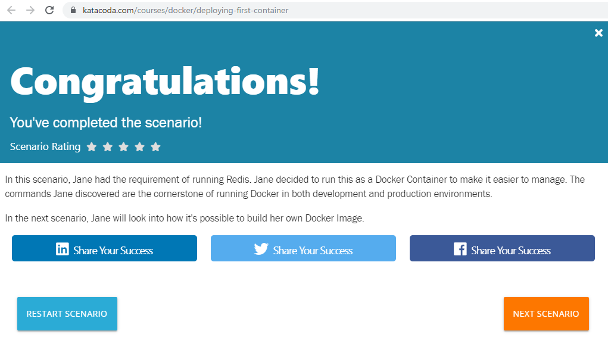
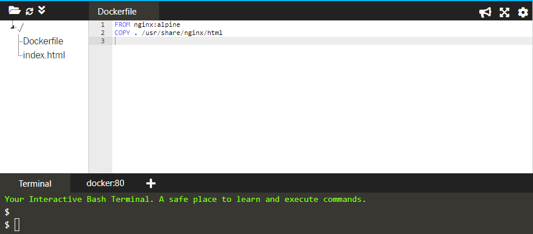
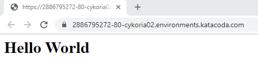
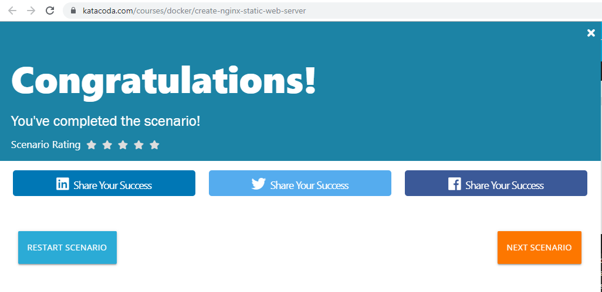
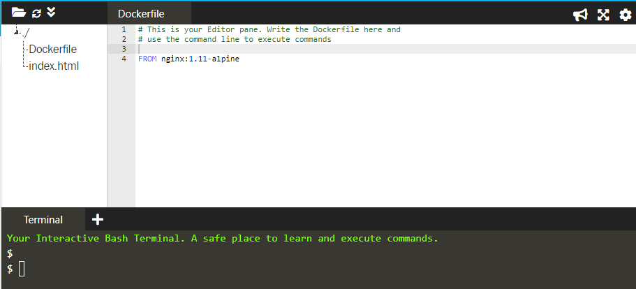
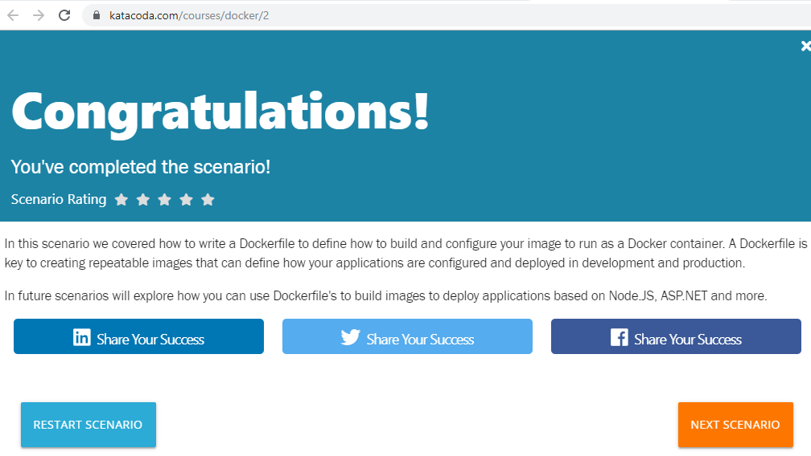

# PRAKTIKUM TEKNOLOGI CLOUD - PERTEMUAN 6

## NAMA : FARIDHOTUL KHASANAH / 175410026
## PRAKTIKUM - Deploying Your First Docker Container

1. Running a container 
Pada taks pertama ini kita mengidentifikasi nama dari docker image dimana konfigurasi ini menggunakan / menjalankan Redis. 

Dengan docker, semua container akan dimulai dengan docker image. Contoh untuk menemukan image untuk Redis dengan cara mengetikkan syntax dibawah ini. 

	```
	$ docker search redis
	NAME                             DESCRIPTION                                     STARS   OFFICIAL            AUTOMATED
	redis                            Redis is an open source key-value store that…   7412   [OK]
	bitnami/redis                    Bitnami Redis Docker Image                      129                       [OK]
	sameersbn/redis                                                                  77                       [OK]
	grokzen/redis-cluster            Redis cluster 3.0, 3.2, 4.0 & 5.0               61
	rediscommander/redis-commander   Alpine image for redis-commander - Redis man…   31                       [OK]
	kubeguide/redis-master           redis-master with "Hello World!"                30
	redislabs/redis                  Clustered in-memory database engine compatib…   23
	oliver006/redis_exporter          Prometheus Exporter for Redis Metrics. Supp…   18
	arm32v7/redis                    Redis is an open source key-value store that…   17
	redislabs/redisearch             Redis With the RedisSearch module pre-loaded…   17
	webhippie/redis                  Docker images for Redis                         10                       [OK]
	s7anley/redis-sentinel-docker    Redis Sentinel                                  9                       [OK]
	insready/redis-stat              Docker image for the real-time Redis monitor…   8                       [OK]
	redislabs/redisgraph             A graph database module for Redis               8                       [OK]
	bitnami/redis-sentinel           Bitnami Docker Image for Redis Sentinel         8                       [OK]
	arm64v8/redis                    Redis is an open source key-value store that…   6
	centos/redis-32-centos7          Redis in-memory data structure store, used a…   4
	redislabs/redismod               An automated build of redismod - latest Redi…   4                       [OK]
	circleci/redis                   CircleCI images for Redis                       2                       [OK]
	frodenas/redis                   A Docker Image for Redis                        2                       [OK]
	runnable/redis-stunnel           stunnel to redis provided by linking contain…   1                       [OK]
	tiredofit/redis                  Redis Server w/ Zabbix monitoring and S6 Ove…   1                       [OK]
	wodby/redis                      Redis container image with orchestration        1                       [OK]
	cflondonservices/redis           Docker image for running redis                  0
	xetamus/redis-resource           forked redis-resource                           0                       [OK]
	```


	```
	$ docker run -d redis
	e03e95cc8e9cc88b415a8d1e268521c2335baa160f63125271f1adeab8262716
	```
	
	```
	$ docker run -d redis:latest
	5cf840eb99472e44df2b420897de3c2d4bed097f75101251b7e98fbaa042f742
	```

2. Finding Running Containers


The launched container is running in the background, the docker ps command lists all running containers, the image used to start the container and uptime.

This command also displays the friendly name and ID that can be used to find out information about individual containers.

The command docker inspect <friendly-name|container-id> provides more details about a running container, such as IP address.

The command docker logs <friendly-name|container-id> will display messages the container has written to standard error or standard out.

	```
	$ docker ps
	CONTAINER ID        IMAGE               COMMAND                  CREATED             STATUS       PORTS               NAMES
	e03e95cc8e9c        redis               "docker-entrypoint.s…"   8 minutes ago       Up 8 minutes       6379/tcp            sad_wescoff
	```

3. Accessing Redis

Jane is happy that Redis is running, but is surprised that she cannot access it. The reason is that each container is sandboxed. If a service needs to be accessible by a process not running in a container, then the port needs to be exposed via the Host.

Once exposed, it is possible to access the process as if it were running on the host OS itself.

Jane knows that by default, Redis runs on port 6379. She has learned that by default other applications and library expect a Redis instance to be listening on the port.

	```
	$ docker run -d --name redisHostPort -p 6379:6379 redis:latest
	dff79316a086057fb41e32371d5ee3ec2e34b0a4193c7e02aa3c48f35575ddd0
	```
	
	```
	
By default, the port on the host is mapped to 0.0.0.0, which means all IP addresses. You can specify a particular IP address when you define the port mapping, for example, -p 127.0.0.1:6379:6379

```
$ docker run -d --name redisHostPort -p 6379:6379 redis:latest
aeff0345aa549f717fe9bfa1e98815eb4bd1f2bb7972da21f42634b92e28ca6a
```

4. Accessing Redis

The problem with running processes on a fixed port is that you can only run one instance. Jane would prefer to run multiple Redis instances and configure the application depending on which port Redis is running on.

	```
	$ docker run -d --name redisDynamic -p 6379 redis:latest
	477253adbab785fa565c7b7b263c9b1d2cb944b1d861509563dd41defd8f26ac
	```
	
	```
	$ docker port redisDynamic 6379
	0.0.0.0:32768
	```
	
	```
	$ docker ps
	CONTAINER ID        IMAGE               COMMAND                  CREATED              STATUS        PORTS                     NAMES
	477253adbab7        redis:latest        "docker-entrypoint.s…"   About a minute ago   Up About a minute   0.0.0.0:32768->6379/tcp   redisDynamic
	dff79316a086        redis:latest        "docker-entrypoint.s…"   2 minutes ago        Up 2 minutes        0.0.0.0:6379->6379/tcp    redisHostPort
	e03e95cc8e9c        redis               "docker-entrypoint.s…"   12 minutes ago       Up 12 minutes       6379/tcp                  sad_wescoff
	```

	```
	$ docker run -d --name redisDynamic -p 6379 redis:latest
	docker port redisDynamic 6379
	c88f3b1c5e6886a41d0c2508b888c41f9e0f00c30459f21310503684dd843cf4
	$ docker port redisDynamic 6379
	0.0.0.0:32768
	```
	
5. Persisting Data

After working with containers for a few days, Jane realises that the data stored keeps being removed when she deletes and re-creates a container. Jane needs the data to be persisted and reused when she recreates a container.

Containers are designed to be stateless. Binding directories (also known as volumes) is done using the option -v <host-dir>:<container-dir>. When a directory is mounted, the files which exist in that directory on the host can be accessed by the container and any data changed/written to the directory inside the container will be stored on the host. This allows you to upgrade or change containers without losing your data.

	```
	$ docker run -d --name redisMapped -v /opt/docker/data/redis:/data redis
	46a59f84761eceb357f6f561547202cf64131319931bbe11238240471343be28
	$ docker run -d --name redisMapped -v /opt/docker/data/redis:/data redis
	docker: Error response from daemon: Conflict. The container name "/redisMapped" is already in useby container "46a59f84761eceb357f6f561547202cf64131319931bbe11238240471343be28". You have to remove (or rename) that container to be able to reuse that name.
	See 'docker run --help'.
	```
	
	```
	$ docker run -d --name redisMapped -v "$PWD/data":/data redis
	48001217e663c0aaf8bf7a05b71af740448f6b77218fe23239eec4c3c42ecf3e
	```
	
6.  Running A Container In The Foreground

	```
	$ docker run ubuntu ps
	  PID TTY          TIME CMD
		1 ?        00:00:00 ps
	```
	
	```
	$ docker run -it ubuntu bash
	root@7a20dbde2c2e:/#
	```
	


## Deploy Static HTML Website as Container

1. Create Dockerfile

Docker Images start from a base image. The base image should include the platform dependencies required by your application, for example, having the JVM or CLR installed.

This base image is defined as an instruction in the Dockerfile. Docker Images are built based on the contents of a Dockerfile. The Dockerfile is a list of instructions describing how to deploy your application.

In this example, our base image is the Alpine version of Nginx. This provides the configured web server on the Linux Alpine distribution.

Create your Dockerfile for building your image by copying the contents below into the editor.



The first line defines our base image. The second line copies the content of the current directory into a particular location inside the container.

2. Build Docker Image

The Dockerfile is used by the Docker CLI build command. The build command executes each instruction within the Dockerfile. The result is a built Docker Image that can be launched and run your configured app.

The build command takes in some different parameters. The format is docker build -t <build-directory>. The -t parameter allows you to specify a friendly name for the image and a tag, commonly used as a version number. This allows you to track built images and be confident about which version is being started.

### Task

Build our static HTML image using the build command below.

```$ docker build -t webserver-image:v1 .
Sending build context to Docker daemon  3.072kB
Step 1/2 : FROM nginx:alpine
 ---> 4d3c246dfef2
Step 2/2 : COPY . /usr/share/nginx/html
 ---> b220593d06c9
Successfully built b220593d06c9
Successfully tagged webserver-image:v1
```

You can view a list of all the images on the host using

```
$ docker images
REPOSITORY          TAG                 IMAGE ID            CREATED             SIZE
webserver-image     v1                  b220593d06c9        24 seconds ago      21.2MB
nginx               alpine              4d3c246dfef2        2 weeks ago         21.2MB
ubuntu              latest              16508e5c265d        13 months ago       84.1MB
redis               latest              4e8db158f18d        14 months ago       83.4MB
weaveworks/scope    1.9.1               4b07159e407b        14 months ago       68MB
alpine              latest              11cd0b38bc3c        15 months ago       4.41MB
```

The built image will have the name webserver-image with a tag of v1.

3. Run

The built Image can be launched in a consistent way to other Docker Images. When a container launches, it's sandboxed from other processes and networks on the host. When starting a container you need to give it permission and access to what it requires.

For example, to open and bind to a network port on the host you need to provide the parameter -p <host-port>:<container-port>.

```
$ docker run -d -p 80:80 webserver-image:v1
2064dd01d1b7325582afb6fe6c7f38b321b8b5da8b4c2347bb127321a1203a13
```

### Task

Launch our newly built image providing the friendly name and tag. As it's a web server, bind port 80 to our host using the -p parameter.

Once started, you'll be able to access the results of port 80 via

```
$ curl docker
<h1>Hello World</h1>
```

To render the requests in the browser use the following links

[Link](https://2886795272-80-cykoria02.environments.katacoda.com/)



You now have a static HTML website being served by Nginx.



## Building Container Images

1. Base Images

All Docker images start from a base image. A base image is the same images from the Docker Registry which are used to start containers. Along with the image name, we can also include the image tag to indicate which particular version we want, by default, this is latest.

These base images are used as the foundation for your additional changes to run your application. For example, in this scenario, we require NGINX to be configured and running on the system before we can deploy our static HTML files. As such we want to use NGINX as our base image.

Dockerfile's are simple text files with a command on each line. To define a base image we use the instruction FROM <image-name>:<tag>

### Task: Creating a Dockerfile

The first line of the Dockerfile should be FROM nginx:1.11-alpine

Make the change in the Dockerfile editor. Within the environment, a new Dockerfile will be created with the contents of the editor.



```
FROM nginx:1.11-alpine
```

2. Running Commands

With the base image defined, we need to run various commands to configure our image. There are many commands to help with this, the main commands two are COPY and RUN.

RUN <command> allows you to execute any command as you would at a command prompt, for example installing different application packages or running a build command. The results of the RUN are persisted to the image so it's important not to leave any unnecessary or temporary files on the disk as these will be included in the image.

COPY <src> <dest> allows you to copy files from the directory containing the Dockerfile to the container's image. This is extremely useful for source code and assets that you want to be deployed inside your container.

### Task

A new index.html file has been created for you which we want to serve from our container. On the next line after the FROM command, use the COPY command to copy index.html into a directory called /usr/share/nginx/html

```
COPY index.html /usr/share/nginx/html/index.html
```

3.  Exposing Ports

With our files copied into our image and any dependencies downloaded, you need to define which port application needs to be accessible on.

Using the EXPOSE <port> command you tell Docker which ports should be open and can be bound to. You can define multiple ports on the single command, for example, EXPOSE 80 433 or EXPOSE 7000-8000

### Task

We want our web server to be accessible via port 80, add the relevant EXPOSE line to the Dockerfile.

```
EXPOSE 80
```

4.  Default Commands

With the Docker image configured and having defined which ports we want accessible, we now need to define the command that launches the application.

The CMD line in a Dockerfile defines the default command to run when a container is launched. If the command requires arguments then it's recommended to use an array, for example ["cmd", "-a", "arga value", "-b", "argb-value"], which will be combined together and the command cmd -a "arga value" -b argb-value would be run.

### Task

The command to run NGINX is nginx -g daemon off;. Set this as the default command in the Dockerfile.

```
CMD ["nginx", "-g", "daemon off;"]
```

5. Building Containers

After writing your Dockerfile you need to use docker build to turn it into an image. The build command takes in a directory containing the Dockerfile, executes the steps and stores the image in your local Docker Engine. If one fails because of an error then the build stops.

### Task

Using the docker build command to build the image. You can give the image a friendly name by using the -t <name> option.

```
$ docker images
REPOSITORY          TAG                 IMAGE ID            CREATED             SIZE
redis               latest              4760dc956b2d        19 months ago       107MB
ubuntu              latest              f975c5035748        19 months ago       112MB
alpine              latest              3fd9065eaf02        21 months ago       4.14MB
nginx               1.11-alpine         bedece1f06cc        2 years ago         54.3MB
```

```
$ docker build -t my-nginx-image:latest .
Sending build context to Docker daemon  3.072kB
Step 1/4 : FROM nginx:1.11-alpine
 ---> bedece1f06cc
Step 2/4 : COPY index.html /usr/share/nginx/html/index.html
 ---> 0e207558566e
Step 3/4 : EXPOSE 80
 ---> Running in 55ec6c23a526
Removing intermediate container 55ec6c23a526
 ---> f8106263eece
Step 4/4 : CMD ["nginx", "-g", "daemon off;"]
 ---> Running in e1ba931e4189
Removing intermediate container e1ba931e4189
 ---> b0007efae561
Successfully built b0007efae561
Successfully tagged my-nginx-image:latest
```

6. Launching New Image

With the image successfully created, you can now launch the container in the same way we described in the first scenario.

### Task

Launch an instance of your newly built image using either the ID result from the build command or the friendly name you assigned it.

NGINX is designed to run as a background service so you should include the option -d. To make the web server accessible, bind it to port 80 using p 80:80

```
$ docker run -d -p 80:80 my-nginx-image:latest
f151125527e8579c242fc80e43c85ca17cbd60f53c12390b669fe9d9c04349a2
```
