# PRAKTIKUM TEKNOLOGI CLOUD - PERTEMUAN 7

## NAMA : FARIDHOTUL KHASANAH / 175410026
## PRAKTIKUM - Zeit
### Instalasi Zeit
Silahkan kunjungi web untuk melakukan instalasi CLI. 
[Ini Link](https://zeit.co/docs). Kemudian silahkan untuk menginstall CLI dengan cara klik link pada homepage. 
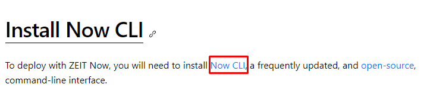
Kemudian silahkan untuk melakukan pilihan apakah akan melakukan menggunakan cloud atau local.
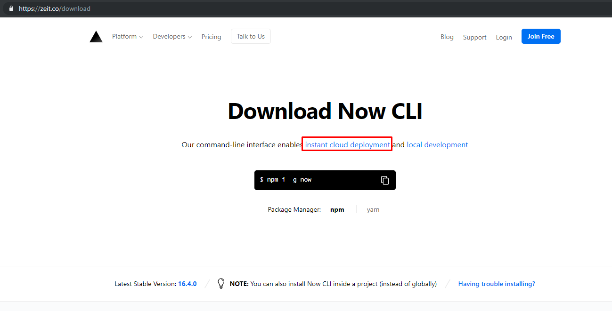
Lalu coba untuk melakukan join free. 
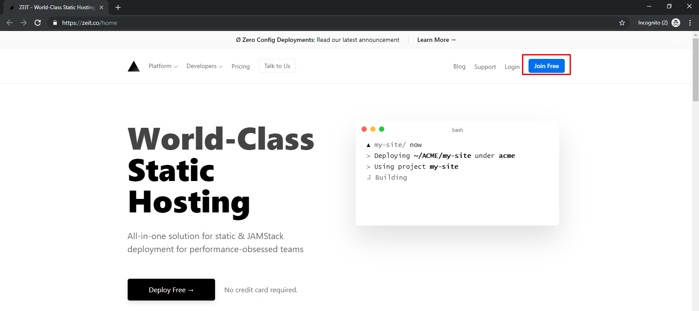
Silahkan pilih dengan continue with GitHub
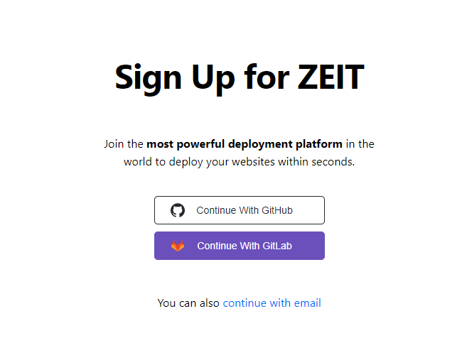
Pada saat dilakukan continue with GitHub, maka diminta verifikasi akun kedalam email yang terdaftar pada gitHub. Lakukan verifikasi dengan cara klik link.   
Silahkan setting profile yang. 
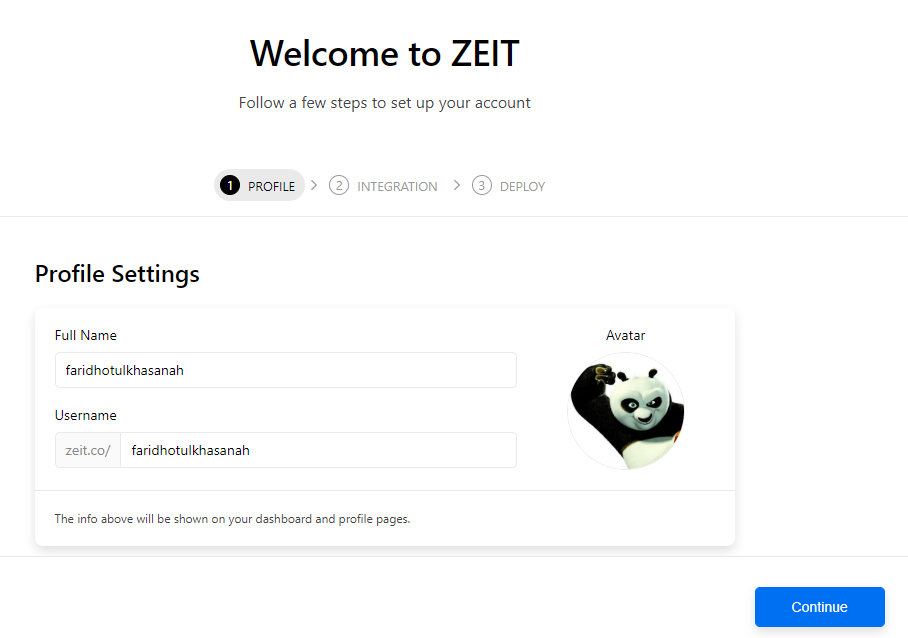
Klik "set Up Now For GITHUB".
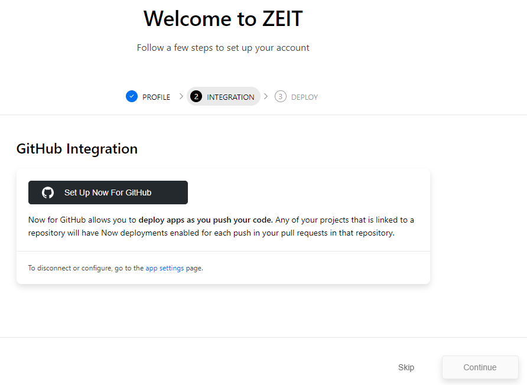
Lalu install personal account yang terhubung dengan github.
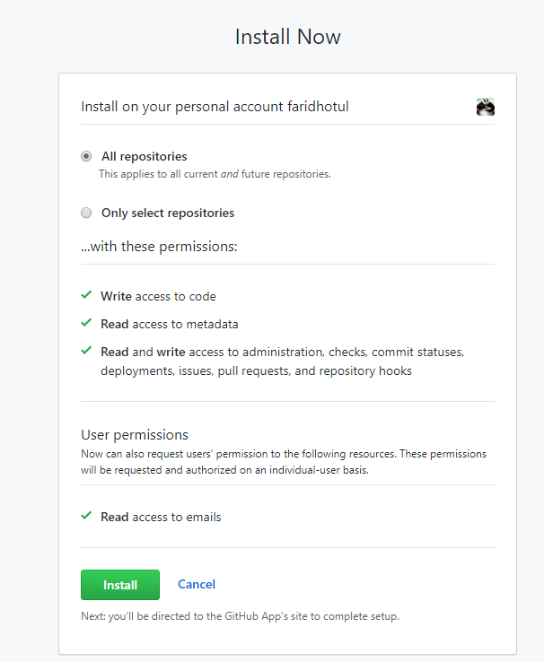
Setelah integrasi kemudian "continued"
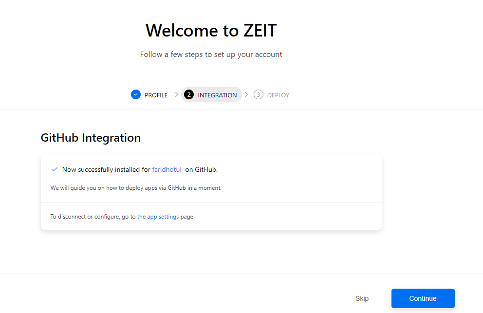
Konfigurasi sudah selesai
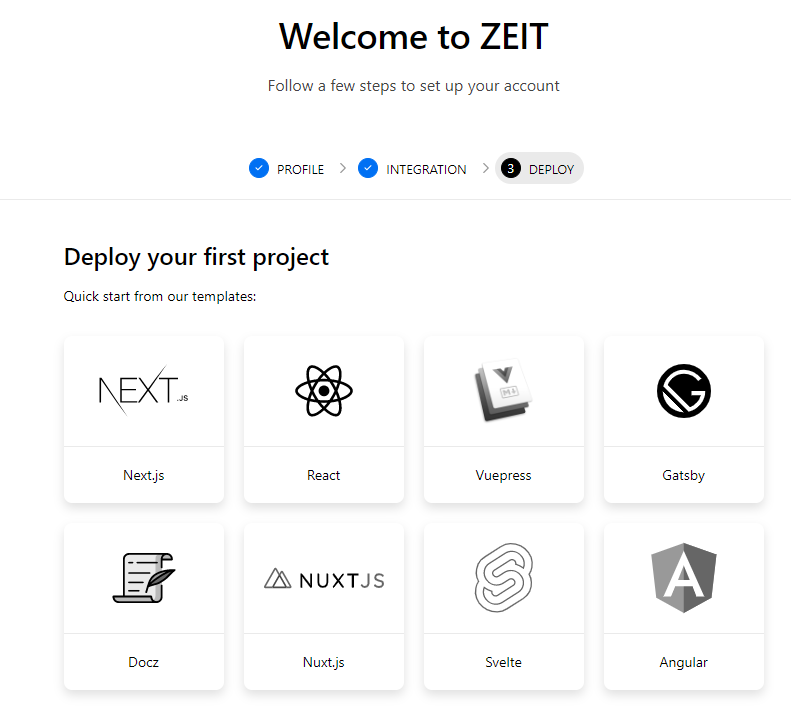
Untuk melakukan create project, kita bisa masuk kedalam dashboard. 
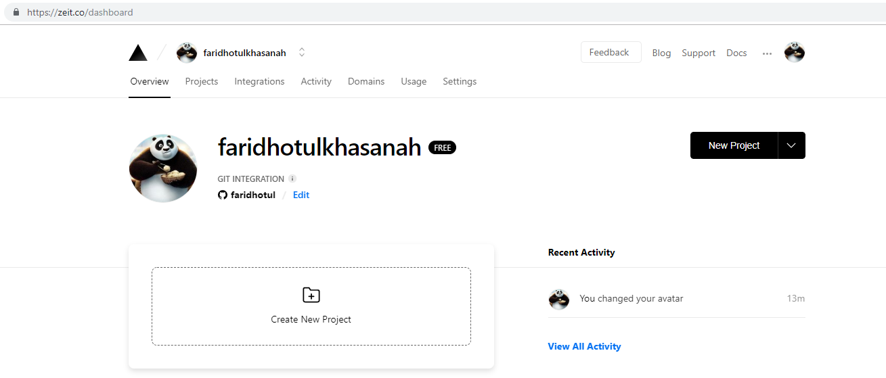

### Create new project Next.js
Selanjutnya untuk membuat project Next.js, kita dapat memilih 'Next.js'. 
Jika sudah terlanjur masuk dashboard, maka silahkan klik "create new project"
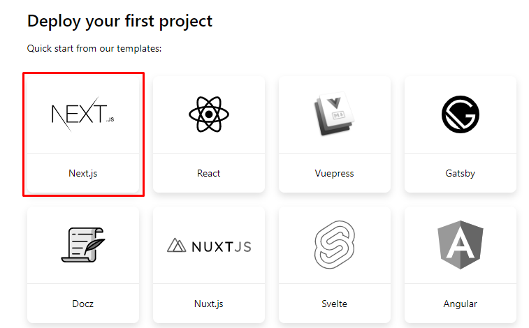
Setelah masuk, kemudian klik Conrinue
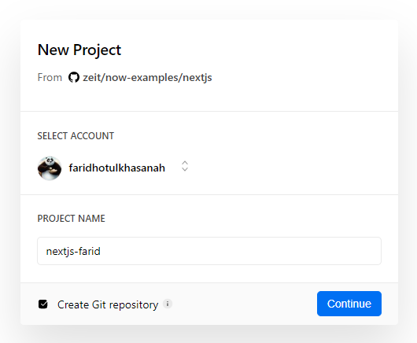
Selanjunya klik "deploy"
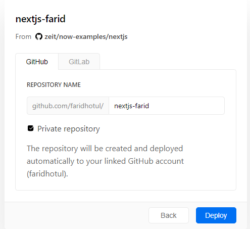
Kita sudah mendeploy sebuah project dengan Next.js yang terintegrasi dengan github. 
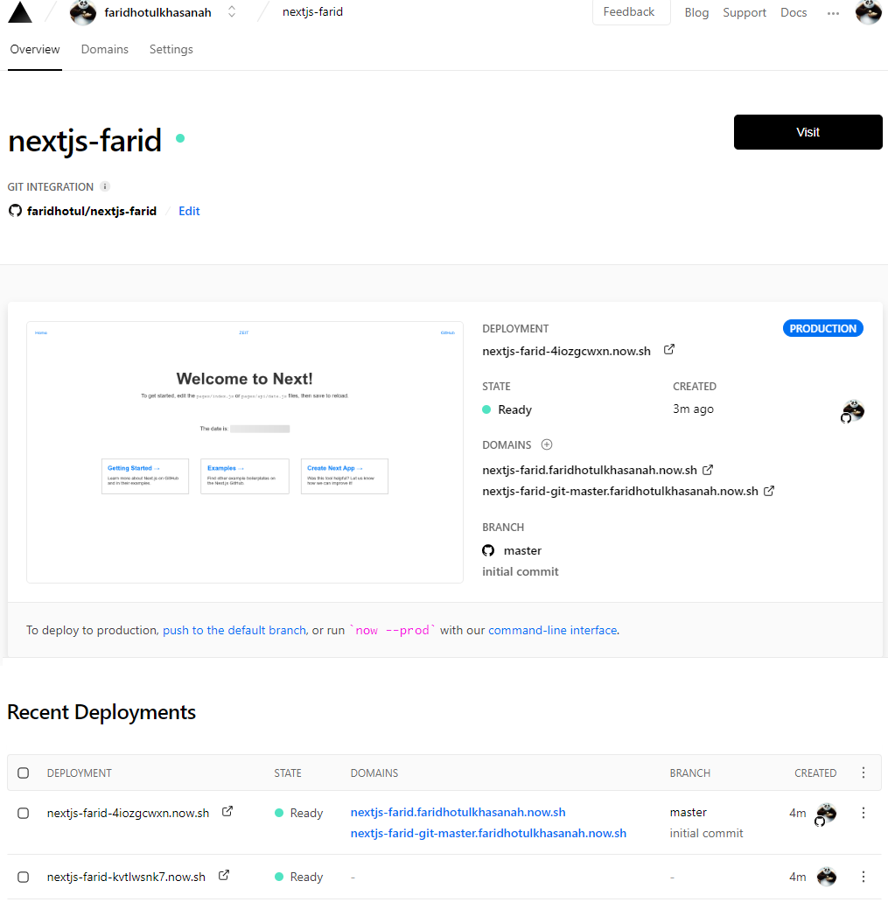
Anda bisa mengakses project saya disini : [Project Zeit Faridhotul](https://zeit.co/faridhotulkhasanah/nextjs-farid)

## PRAKTIKUM - pythonanywhere.com

## PRAKTIKUM - gigalixir