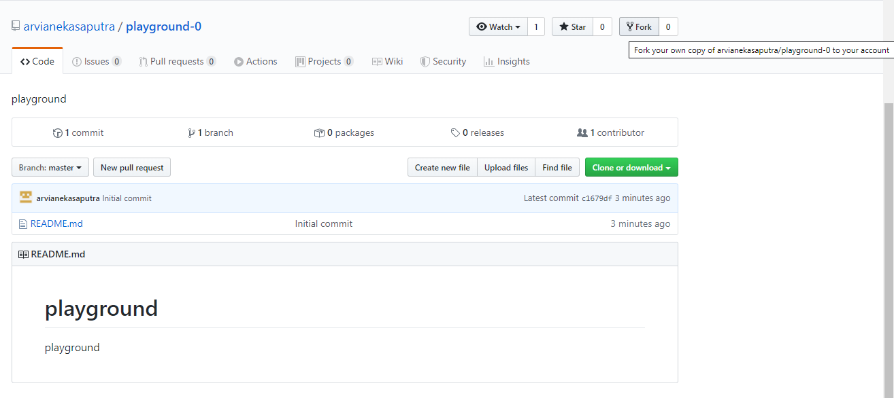
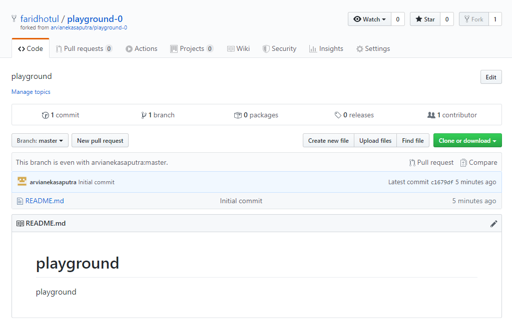
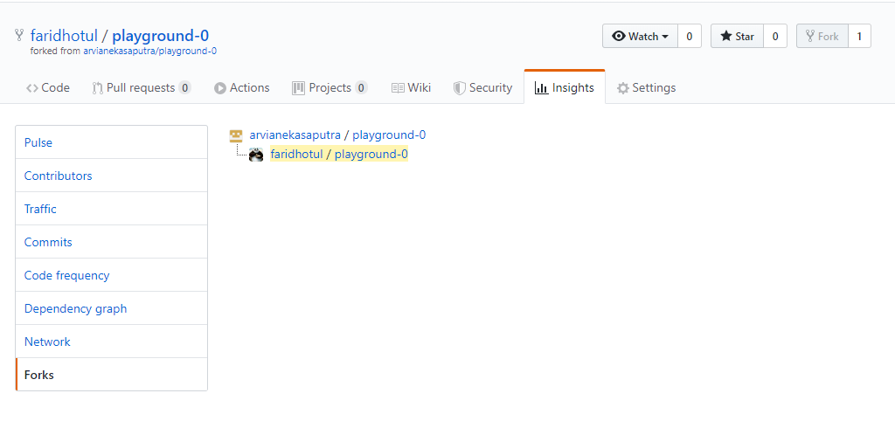
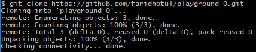
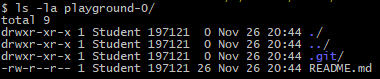
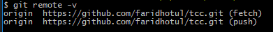
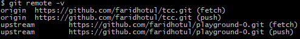

# PRAKTIKUM TEKNOLOGI CLOUD - PERTEMUAN 10

## NAMA : FARIDHOTUL KHASANAH / 175410026
## PRAKTIKUM - Git untuk Kolaborasi
---------------------------------------------
## Fork

1. Login ke github

2. Akses repo yang akan di-fork, contoh :
[Ini Link](https://github.com/arvianekasaputra/playground-0)

3. Pada sisi kanan atas, klik Fork: 



4. Setelah proses, repo dari upstream author sudah berada di account GitHub kita (kontributor). Fork dari repo milik arvianekasaputra berhasil.





5. Setelah proses tersebut, clone di komputer lokal: 

```$ git clone https://github.com/faridhotul/playground-0.git```



```$ ls -la playground-0/```




6. konfigurasikan repo lokal kontributor

```$ git remote -v```



```$ git remote add upstream https://github.com/faridhotul/playground-0.git```


```$ git remote -v```



### Mengirimkan Pull Request

1. Kontributor akan bekerja di repo lokal (create, update, delete isi)
2. Commit
3. Push ke repo kontributor
4. Kirimkan PR ke repo upstream author.
5. Upstream author me-review dan kemudian menyetujui (merge) ke master atau menolak PR.
6. Jika disetujui dan di-merge ke repo master dari upstream author, sinkronkan repo di komputer lokal dan repo GitHub kontributor.