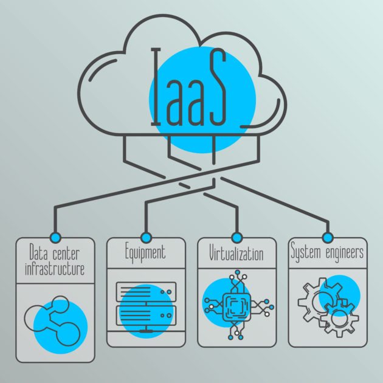

# PRAKTIKUM TEKNOLOGI CLOUD - PERTEMUAN 11

## NAMA : ARVIAN EKA SAPUTRA (175410041) FARIDHOTUL KHASANAH (175410026)
## PRAKTIKUM - IAAS
---------------------------------------------
1. KONSEP IAAS

**IaaS (Infrastruktur as a Service)** jika diartikan menurut bahasa Indonesia adalah layanan infrastruktur komputasi awan. Layanan cloud IaaS biasanya terdiri dari satu paket perangkat hardware komputer berupa virtualisasi, dengan jaringan internet, dukungan alamat IP, bandwitch, keseimbangan beban, jaminan online secara realtime (koneksi ke internet secara kontinyu) serta keamanan pada ruang lingkup satu unit layanan IaaS. Provider umumnya menyediakan layanan dengan berbagai spesifikasi, yakni CPU, RAM serta Data Storage dalam bentuk virtualisasi.

2. BERBAGAI SOFTWARE IAAS

3. GETTING STARTED IAAS

4. ARSITEKTUR DAN KONSEP DEPLOYMENT PADA PROXMOX