# PRAKTIKUM TEKNOLOGI CLOUD - PERTEMUAN 11

## NAMA : ARVIAN EKA SAPUTRA (175410041) || FARIDHOTUL KHASANAH (175410026) || ROCHMAD WIDIANTO (185410014)
## PRAKTIKUM - IAAS
---------------------------------------------
**1. KONSEP IAAS**

**IaaS (Infrastruktur as a Service)** jika diartikan menurut bahasa Indonesia adalah layanan infrastruktur komputasi awan. Layanan cloud IaaS biasanya terdiri dari satu paket perangkat hardware komputer berupa virtualisasi, dengan jaringan internet, dukungan alamat IP, bandwitch, keseimbangan beban, jaminan online secara realtime (koneksi ke internet secara kontinyu) serta keamanan pada ruang lingkup satu unit layanan IaaS. Provider umumnya menyediakan layanan dengan berbagai spesifikasi, yakni CPU, RAM serta Data Storage dalam bentuk virtualisasi.

**2. BERBAGAI SOFTWARE IAAS**

2.1 . AT & T Cloud Solutions
Dengan persembahan jaringan global AT & T, Anda dapat mengoptimalkan komputasi,penyimpanan, perangkat lunak, pengembangan dan bahkan sumber daya jaringan dalam lingkungan berbasis cloud. AT & T menawarkan end-to-end kapasitas pengiriman pada skala global, didukung oleh puluhan tahun pengalaman dan keahlian terbesar. Bersama dengan ekosistem penyedia layanan kami yang luas, kami menyediakan luasnya besar kemampuan cloud, keamanan, dan jaringan. Semua melalui titik kontak.

2.2 Amazon EC2
Amazon EC2 dalah platform komputasi berupa virtual computer yang dapat di kustomisasi maupun di kembangkan dengan menggunakan prinsip cluster dan load balance. Untuk deployment nya sendiri sangat mudah sekali karena hanya perlu memilih image yang disebut AMI (Amazon Machine Instances) dan setup hanya perlu 5-10 menit.

2.3  NaviSite
NaviSite, Inc., merupakan Time Warner Cable Company, adalah penyedia internasional terkemuka dari pelayanan dan pengaturan aplikasi-aplikasi kelas enterprise dan hosting cloud. NaviSite menyediakan rangkaian lengkap dari layanan yang dikelola serta dapat diandalkan dan terukur, termasuk pelayanan aplikasi, Hosting perusahaan yang terdepan dalam industri, dan pelayanan pengaturan Cloud untuk organisasi ingin melakukan outsourcing infrastruktur TI dan membantu menurunkan modal serta biaya operasional. Konsumen perusahaan bergantung pada NaviSite untuk solusi khusus, yang disampaikan melalui pusat data kelas internasional yang canggih.

**3. GETTING STARTED IAAS**
Instalasi Proxmox

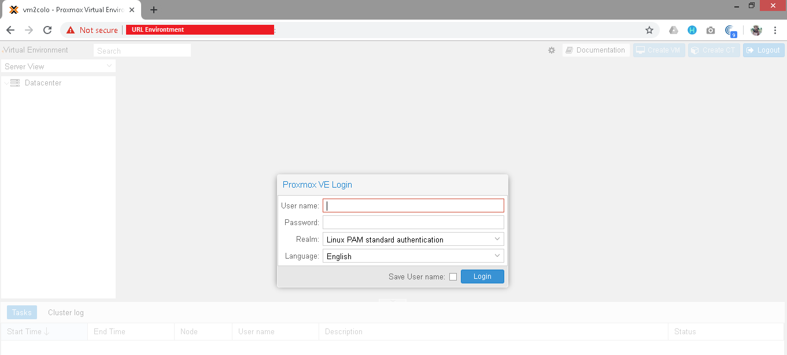

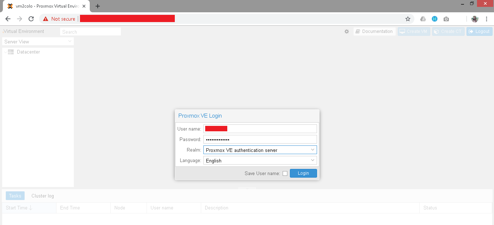

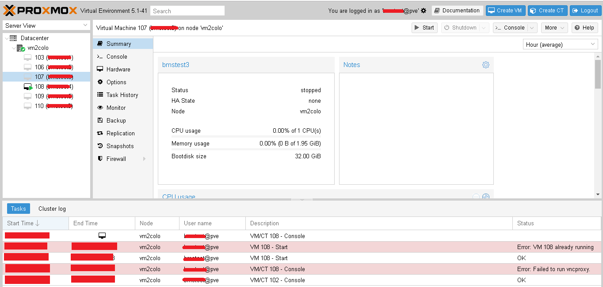

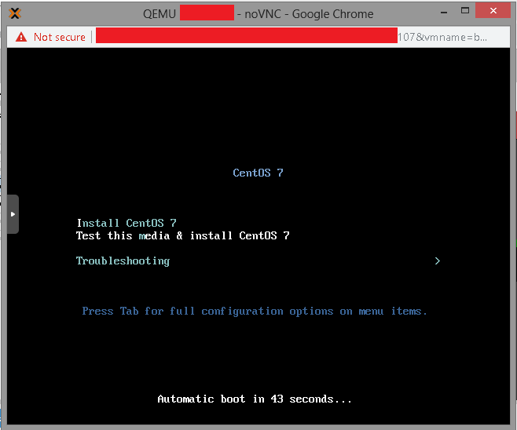

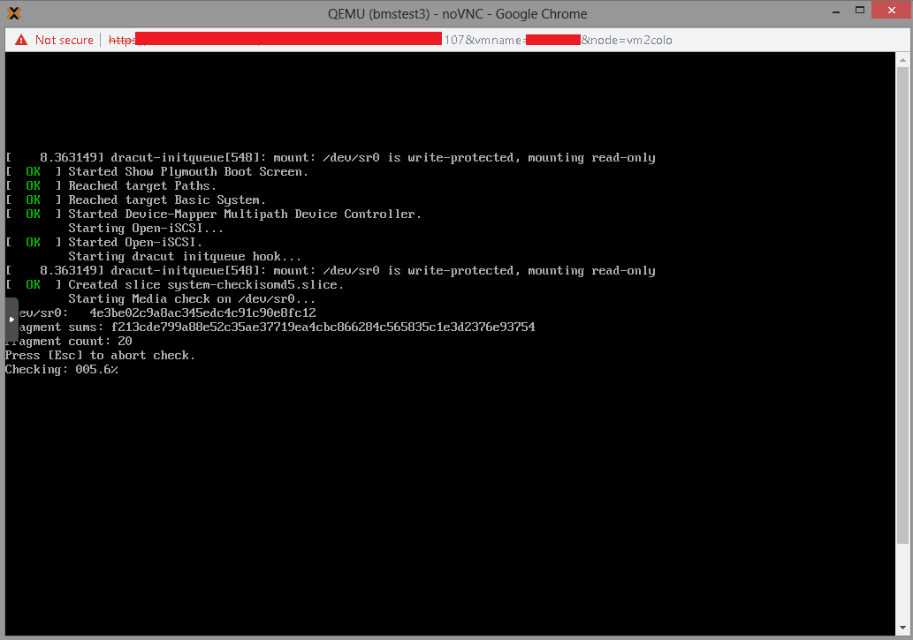

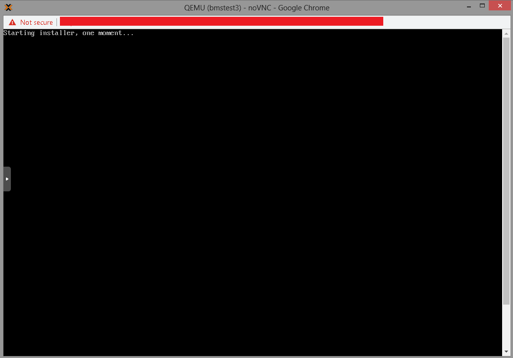

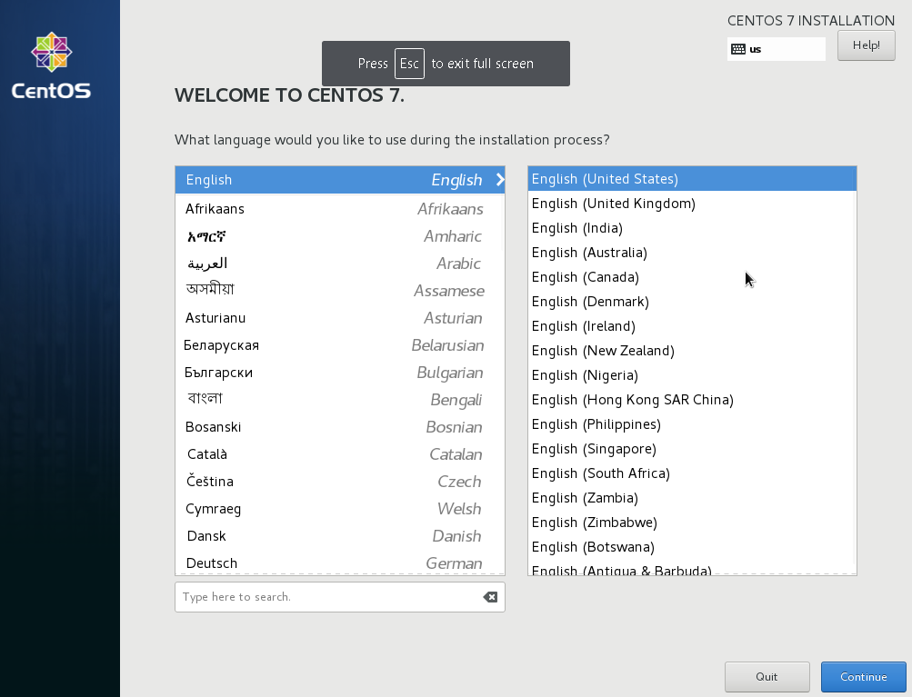

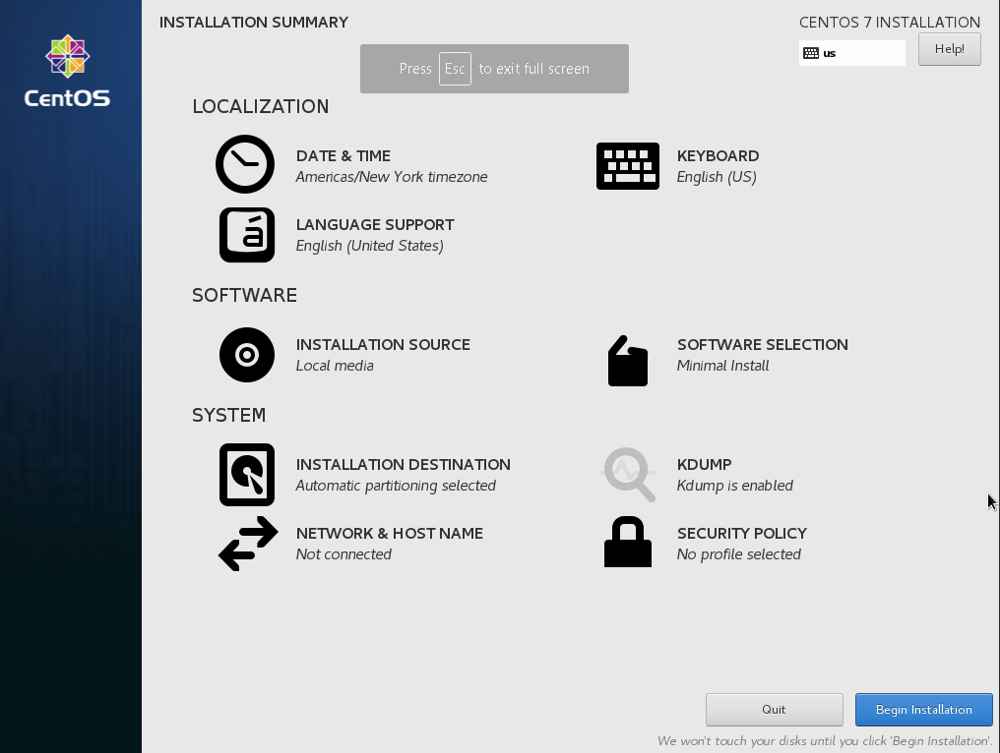

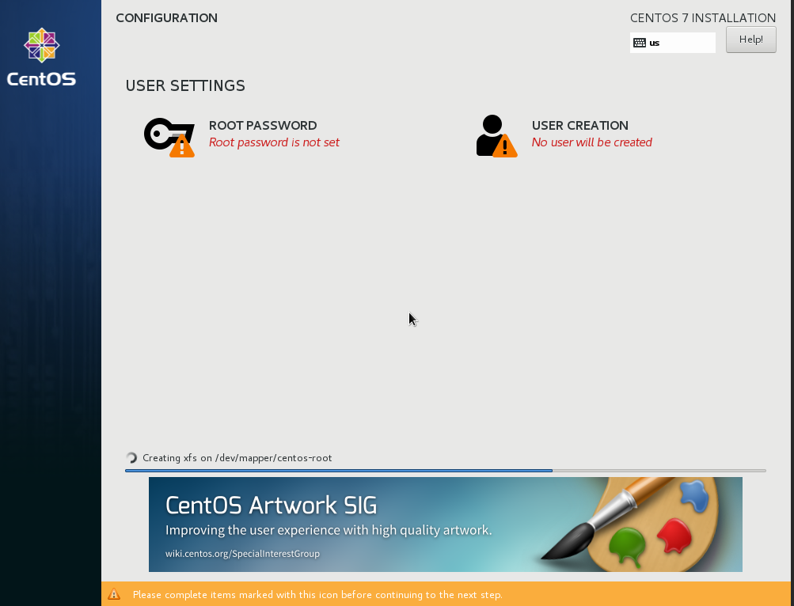

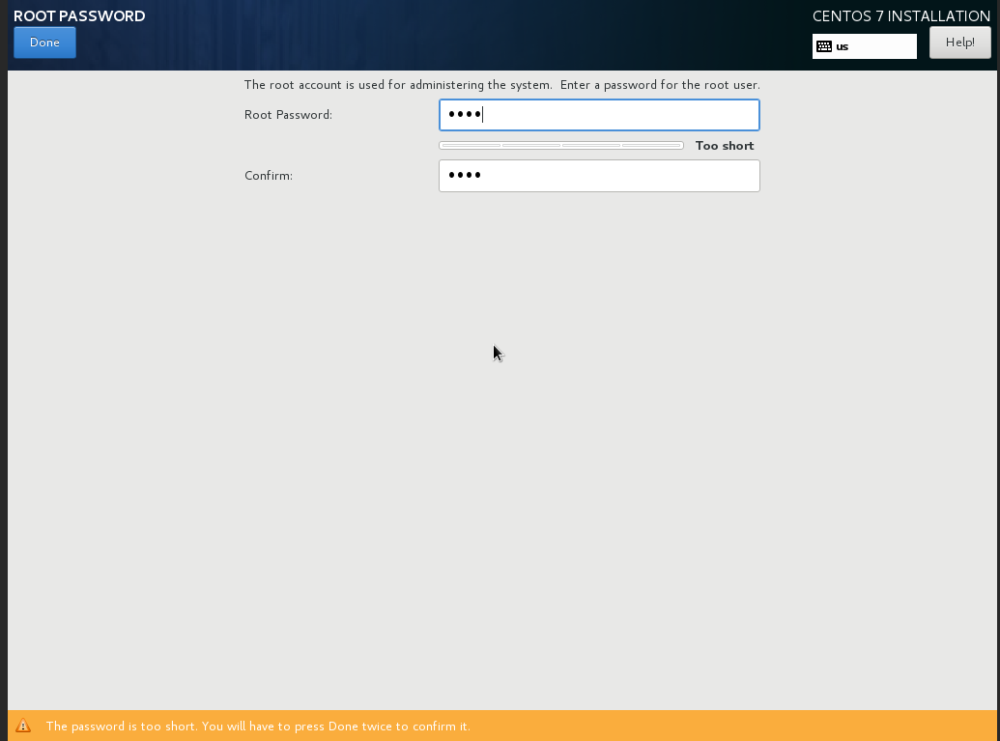

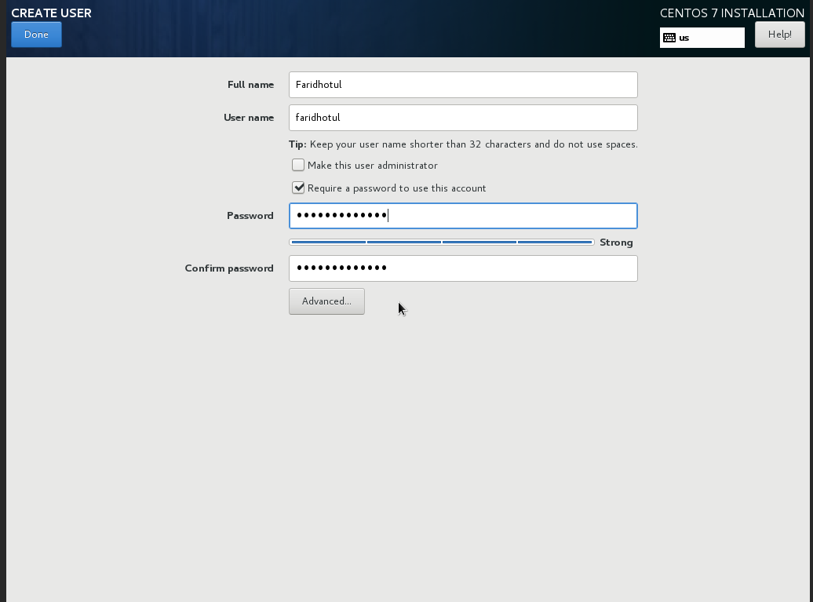

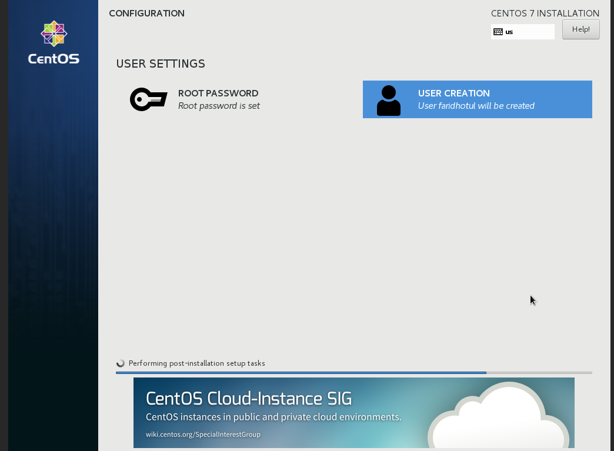

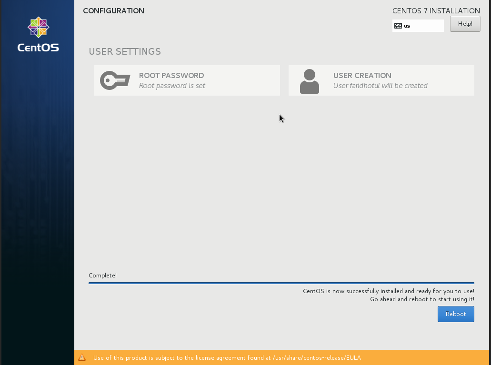

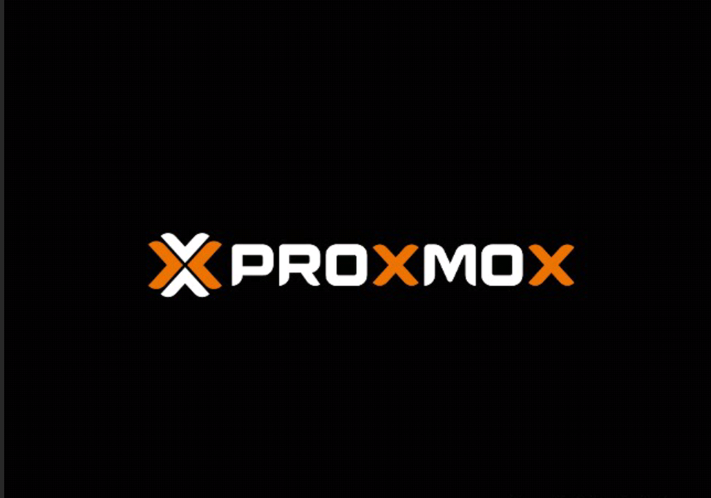

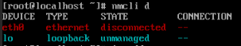

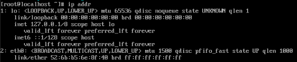

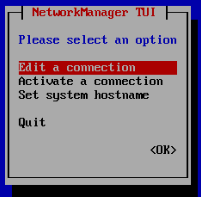

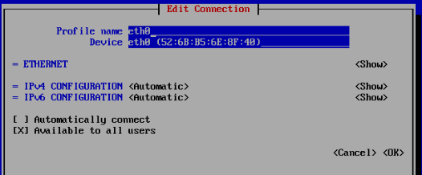

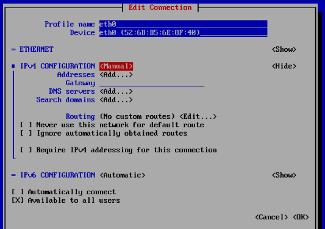

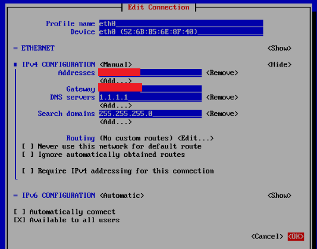

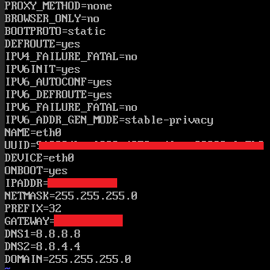

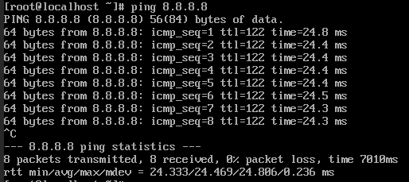

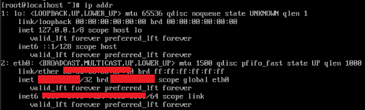

**4. ARSITEKTUR DAN KONSEP DEPLOYMENT PADA PROXMOX**

 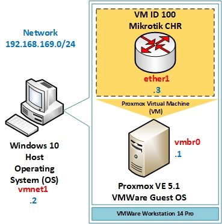

 Proxmox mendukung beberapa metode manajemen user, di antaranya adalah LDAP, Active Diretory (AD), Linux PAM, dan Proxmox VE authentication server. LDAP dan AD membutuhkan server eksternal khusus untuk autentikasi. Sedangkan Linux PAM dan Proxmox VE authentication merupakan autentikasi internal. Konsep manajemen user ini memungkinkan kita untuk membuat user dan group lalu memberikan role dan permission untuk pengelolaan Proxmox VE. Kita juga dapat memberikan akses mengubah konfigurasi komponen seperti storage, VM, atau sistem ke user/group tertentu saja. Kita bahkan dapat membuat user/group yang hanya dapat melihat tapi tidak dapat mengubah konfigurasi.