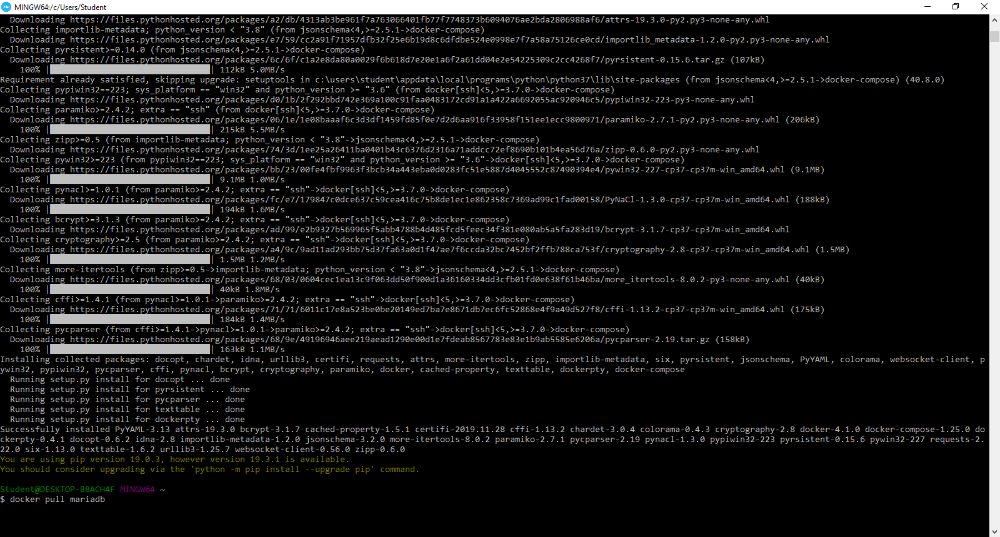

# PRAKTIKUM TEKNOLOGI CLOUD - PERTEMUAN 12

## FARIDHOTUL KHASANAH (175410026)
## PRAKTIKUM - INSTALL DOCKER COMPOSE DENGAN DRUPAL
---------------------------------------------
1. Buka docker 


2. Install Docker Compose

```pip install -U docker-compose```




Diminta untuk upgrade


3. Install Drupal

```docker pull mariadb```


4. Kemudian gunakan versi paling terakhir.

```docker pull drupal:latest```


5. Lihat docker image

```docker images```


6. Now we run Drupal container with a link to just created MariaDB and the binding to the 80-th port. The link is just a record in /etc/hosts specifying IP of the container with MariaDB in a virtual network created by Docker during its installation.

```docker run -e MYSQL_ROOT_PASSWORD=admin -e MYSQL_DATABASE=drupal8 -e MYSQL_USER=drupal8 -e MYSQL_PASSWORD=drupal8 -v mariadb:/var/lib/mysql -d --name mariadb mariadb```


```docker run --name drupal8 --link mariadb:mysql -p 80:80 -d drupal:latest```


7. Lihat container

```docker ps```


Sumber :
1. https://hub.docker.com/_/drupal/
2. https://duvien.com/blog/using-docker-setup-test-environment-drupal-8-less-2-minutes
