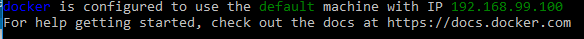
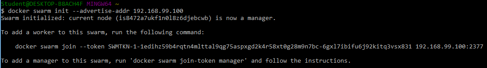
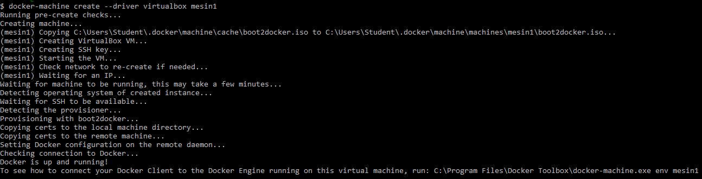

# PRAKTIKUM TEKNOLOGI CLOUD - PERTEMUAN 13

## FARIDHOTUL KHASANAH (175410026)
## PRAKTIKUM - DOCKER SWARM
---------------------------------------------

1. Pada docker yang digunakan, menggunakan default mesin dengan IP sbb:



2. Melakukan init



3. Membuat VMs dengan nama Mesin1 dan Mesin2 menggunakan perintah docker-machine create --driver virtualbox vm1

```$ docker-machine create --driver virtualbox mesin1```



```$ docker-machine create --driver virtualbox mesin2```

4. Perintahkan mesin1 menjadi swarm manager dengan ssh ke mesin mesin1 kemudian menjalankan perintah docker swarm init --advertise-addr 192.168.99.101, IP disini menggunakan ip mesin1. sebelum menjalankan perintah di atas jalankan perintah docker-machine ssh mesin1

```$ docker-machine ssh mesin1```

5. Cek status swarm dengan perintah docker info

```docker@mesin1:~$ docker info```

Swarm sudah aktif Swarm: active

6. Cek node yang sedang berjalan docker node ls

```docker@mesin1:~$ docker node ls```

7. Gunakan perintah exit untuk keluar dari mesin1 exit

```docker@mesin1:~$ exit```

8. Selanjutnya menjalankan mesin2 docker-machine ssh mesin2

```$ docker-machine ssh mesin2```

9. Keluar dari mesin2

```docker@mesin2:~$ exit```

10. Join mesin2 ke swarm mesin1 dengan perintah docker swarm join --token (token) ip

```$ docker swarm join --token SWMTKN-1-1wf4nnd2h1avas2c9wyoplkesnlhcdyq5lattcro5k```

11. Masuk / login ke mesin1

```$ docker-machine ssh mesin1```

12. Cek apakah sudah terhubung atau belum antara mesin1 dan mesin2 dengan cara docker node ls kalau sudah status Ready maka berhasil

```docker@mesin1:~$ docker node ls```

Sumber : https://docs.docker.com/engine/swarm/