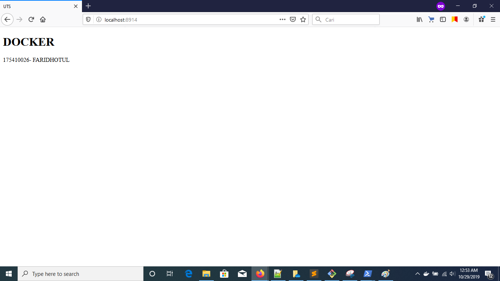

# TEORI TEKNOLOGI CLOUD - UJIAN TENGAH SEMESTER

## NAMA : FARIDHOTUL KHASANAH / 175410026
## UTS - DockerImage

1. Pertama, silahkan login terlebih kesini : [Link](https://hub.docker.com/)

2. Setelah login, silahkan membuat direktori baru. 


```
PS C:\Users\User> mkdir faridhotul
    Directory: C:\Users\User


Mode                LastWriteTime         Length Name
----                -------------         ------ ----
d-----       10/29/2019  12:48 AM                faridhotul

```

3. Lalu masuk ke direktori yang sudah dibuat tadi. 

`PS C:\Users\User> cd faridhotul`

4. Kemudian built repo dengan cara :

```
PS C:\Users\User\faridhotul> docker build -t faridhotul/faridhotul:v1 .
Sending build context to Docker daemon  3.072kB
Step 1/2 : FROM nginx:alpine
 ---> b6753551581f
Step 2/2 : COPY . /usr/share/nginx/html
 ---> Using cache
 ---> 57221ec61f04
Successfully built 57221ec61f04
Successfully tagged faridhotul/faridhotul:v1
SECURITY WARNING: You are building a Docker image from Windows against a non-Windows Docker host. All files and directories added to build context will have '-rwxr-xr-x' permissions. It is recommended to double check and reset permissions for sensitive files and directories.

```

faridhotul/faridhotul:v1 merepresentasikan direktory/repository:tag

5. Cek apakah sudah berhasil terbuilt. 

```
PS C:\Users\User\faridhotul> docker images
REPOSITORY                TAG                 IMAGE ID            CREATED             SIZE
arviansapu/arviansapu     v2                  57221ec61f04        15 minutes ago      21.4MB
arviansapu/arviansapu     v3                  57221ec61f04        15 minutes ago      21.4MB
faridhotul/faridhotul     v1                  57221ec61f04        15 minutes ago      21.4MB
riyans/riyans             v1                  75955f90dc0a        49 minutes 
```

Pada hasil diatas, kita bisa tau bahwa repo faridhotul sudah berhasil terbuat.

6. Selanjutnya silahkan run dengan mengganti port menjadi 8914 dengan inisasi nama alias khasanah. 

```
PS C:\Users\User\faridhotul> docker run -d -p 8914:80 --name=khasanah faridhotul/faridhotul:v1
f6e9784392f3f98f517116d05bbd557be57ac44cebdd7cefc0f8da4294d2090b
```

7. Cek ke localhost. localhost:8914



8. Kemudian melakukan push kedalam docker. 

- Caranya adalah lakukan sign in terlebih dahulu kedalam docker yang sudah terinstall di local kita. 

- Selanjutnya ketikkan syntax dibawah ini untuk add / pengenalan terlebih dahulu. 

```
PS C:\Users\User\faridhotul> docker tag faridhotul/faridhotul:v1 faridhotul/faridhotul:v1
```

- Kemudian lakukan push sebagai berikut 

```
PS C:\Users\User\faridhotul> docker push faridhotul/faridhotul:v1
The push refers to repository [docker.io/faridhotul/faridhotul]
26fed130bdf4: Pushed                                                                                                    bba7d2385bc1: Mounted from faridhotul/faridhotul                                                                      77cae8ab23bf: Mounted from faridhotul/faridhotul                                                                      v1: digest: sha256:ed241f764596d450bcfd25b62534d503a7a1ac23d8b8d318b2e6940dc5ccc4d4 size: 946
```